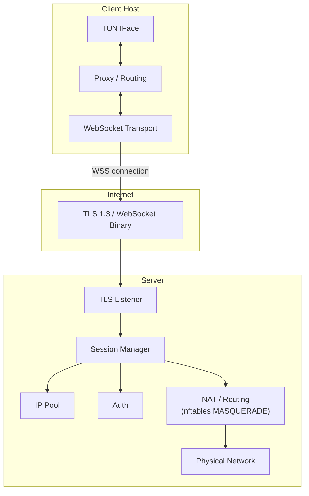

<!-- @sk-task docs-and-release#T3.2: architecture documentation (AC-003) -->

# Architecture

kvn-ws is a VPN tunnel over HTTPS/WebSocket written in Go. This document describes the system architecture, components, and data flow.

## Overview



## Components

### Server

| Component | Package | Role |
|-----------|---------|------|
| TLS Listener | `src/internal/transport/tls/` | TLS 1.3 termination |
| WebSocket Acceptor | `src/internal/transport/websocket/` | WebSocket upgrade and binary frame I/O |
| Session Manager | `src/internal/session/` | Session lifecycle, IP allocation/reclaim, BoltDB persistence |
| IP Pool | `src/internal/session/` | Dynamic IPv4/IPv6 allocation from configurable subnets |
| Auth | `src/internal/protocol/auth/` | Token, JWT, and basic authentication |
| Control | `src/internal/protocol/control/` | PING/PONG keepalive, session control messages |
| NAT | `src/internal/nat/` | nftables MASQUERADE for traffic forwarding |
| DNS | `src/internal/dns/` | DNS resolver with in-memory TTL cache |
| Metrics | `src/internal/metrics/` | Prometheus metrics (active_sessions, throughput, errors) |

### Client

| Component | Package | Role |
|-----------|---------|------|
| TUN Interface | `src/internal/tun/` | Virtual network interface abstraction |
| Routing Engine | `src/internal/routing/` | RuleSet engine: server/direct, CIDR, domain, IP matching |
| Proxy Listener | `src/internal/proxy/` | SOCKS5 + HTTP CONNECT proxy for local traffic |
| WebSocket Dialer | `src/internal/transport/websocket/` | WebSocket client connection |
| DNS Resolver | `src/internal/dns/` | DNS resolution with TTL caching |
| Crypto | `src/internal/crypto/` | App-layer encryption/decryption |

### Shared

| Component | Package | Role |
|-----------|---------|------|
| Config | `src/internal/config/` | YAML config parsing via viper with env override |
| Logger | `src/internal/logger/` | Structured JSON logging via zap |
| Framing | `src/internal/transport/framing/` | Binary frame protocol (length-prefixed messages) |
| Handshake | `src/internal/protocol/handshake/` | Client/Server Hello protocol negotiation |

## Data flow

### Connection establishment (handshake)

1. Client reads config from `client.yaml`
2. Client establishes TLS 1.3 connection to server URL
3. Client sends WebSocket upgrade request with `/ws` path
4. Server accepts WebSocket connection, upgrades to binary mode
5. Client sends `ClientHello` frame (protocol version, supported features)
6. Server responds with `ServerHello` (session ID, assigned IP, capabilities)
7. Client configures TUN interface with assigned IP
8. Client routing engine starts processing packets

### Data transfer

1. Application on client sends packet to TUN interface
2. Client routing engine evaluates rules (ordered): direct or tunnel
3. For tunnel: packet is encapsulated in binary WebSocket frame, optionally encrypted
4. Server receives frame, decrypts if needed, extracts packet
5. Server applies NAT (MASQUERADE) and forwards to target
6. Response follows reverse path: server receives → encapsulates → sends over WebSocket → client extracts → injects to TUN

### Keepalive

- Client sends PING frames periodically
- Server responds with PONG
- If no activity within `session.idle_timeout_sec`, server reclaims the session

## Code organization

```
src/
├── cmd/
│   ├── client/main.go       # Client entrypoint
│   ├── server/main.go       # Server entrypoint
│   └── gatetest/main.go     # Gate test tool
├── internal/
│   ├── config/              # YAML config (viper)
│   ├── crypto/              # App-layer encryption
│   ├── dns/                 # DNS resolver + cache
│   ├── logger/              # Structured logging (zap)
│   ├── metrics/             # Prometheus metrics
│   ├── nat/                 # nftables MASQUERADE
│   ├── protocol/
│   │   ├── auth/            # Token/JWT/basic auth
│   │   ├── control/         # PING/PONG keepalive
│   │   └── handshake/       # Client/Server Hello
│   ├── proxy/               # SOCKS5 + HTTP CONNECT
│   ├── routing/             # RuleSet engine
│   ├── session/             # Session + IP pool + BoltDB
│   ├── transport/
│   │   ├── framing/         # Binary frame protocol
│   │   ├── tls/             # TLS config
│   │   └── websocket/       # WebSocket dial/accept
│   └── tun/                 # TUN interface
└── pkg/
    └── api/                 # Public API (extensible)
```
