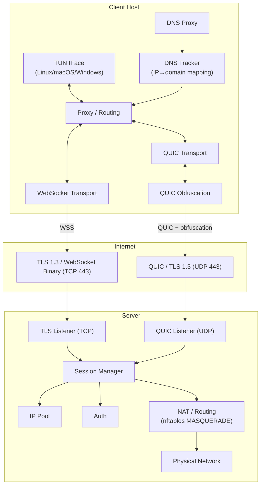

<!-- @sk-task docs-and-release#T3.2: architecture documentation (AC-003) -->

# Architecture

kvn-ws is a VPN tunnel over HTTPS/WebSocket and QUIC written in Go. This document describes the system architecture, components, and data flow.

## Overview



## Components

### Server

| Component | Package | Role |
|-----------|---------|------|
| TLS Listener | `src/internal/transport/tls/` | TLS 1.3 termination (TCP) |
| WebSocket Acceptor | `src/internal/transport/websocket/` | WebSocket upgrade and binary frame I/O |
| QUIC Listener | `src/internal/transport/quic/` | QUIC (UDP) listener + ObfuscatedQUICConn |
| Bootstrap | `src/internal/bootstrap/` | Server orchestration: TLS, QUIC, session manager |
| Session Manager | `src/internal/session/` | Session lifecycle, IP allocation/reclaim, BoltDB persistence |
| IP Pool | `src/internal/session/` | Dynamic IPv4/IPv6 allocation from configurable subnets |
| Auth | `src/internal/protocol/auth/` | Token, JWT, and basic authentication |
| Control | `src/internal/protocol/control/` | PING/PONG keepalive, session control messages |
| Admin API | `src/internal/admin/` | Admin HTTP API for session management and pprof |
| NAT | `src/internal/nat/` | nftables/iptables MASQUERADE (auto-fallback) |
| DNS | `src/internal/dns/` | DNS resolver with in-memory TTL cache |
| Metrics | `src/internal/metrics/` | Prometheus metrics (active_sessions, throughput, errors) |
| Rate Limiter | `src/internal/ratelimit/` | Per-IP rate limiter (token bucket) |
| ACL | `src/internal/acl/` | CIDR-based IP access control (allow/deny) |

### Client

| Component | Package | Role |
|-----------|---------|------|
| TUN Interface | `src/internal/tun/` | Virtual network interface abstraction. Platforms: Linux (tun), Windows (Wintun), macOS (utun), stub |
| Routing Engine | `src/internal/routing/` | RuleSet engine: server/direct, CIDR, domain (suffix + exact), IP matching. DNS tracker lookup for domain-based routing |
| Tunnel Session | `src/internal/tunnel/` | VPN tunnel session: links TUN, crypto, proxy, transport |
| Bootstrap | `src/internal/bootstrap/` | Client orchestration: TUN, DNS, proxy, transport. Platform DNS: setupDNS/applyDNS/restoreDNS |
| Proxy Listener | `src/internal/proxy/` | SOCKS5 + HTTP CONNECT proxy for local traffic |
| Transparent Proxy | `src/internal/transparent/` | Transparent proxy via iptables REDIRECT (Linux) |
| System Proxy | `src/internal/systemproxy/` | OS-level proxy settings management (Linux/macOS/Windows) |
| DNS Proxy | `src/internal/dnsproxy/` | DNS forwarding proxy: intercepts and routes DNS queries. IP→domain tracking for domain-based routing |
| DNS Tracker | `src/internal/dns/` | DNS tracker: stores IP→domain mapping with TTL. Used by Routing Engine for direct/tunnel decisions |
| WebSocket Dialer | `src/internal/transport/websocket/` | WebSocket client connection with optional padding |
| uTLS Dialer | `src/internal/transport/tls/` | Browser-like TLS (uTLS, Chrome JA3), custom SNI selection |
| QUIC Dialer | `src/internal/transport/quic/` | QUIC (UDP) dial + ObfuscatedQUICConn |
| DNS Resolver | `src/internal/dns/` | DNS resolution with TTL caching |
| Crypto | `src/internal/crypto/` | App-layer encryption (AES-256-GCM, per-session key) |
| Web UI | `src/internal/webui/` | Local web interface (React + REST API for config/connect/monitoring) |

### Shared

| Component | Package | Role |
|-----------|---------|------|
| Config | `src/internal/config/` | YAML config parsing via viper with env override |
| Logger | `src/internal/logger/` | Structured JSON logging via zap |
| Framing | `src/internal/transport/framing/` | Binary frame protocol (length-prefixed messages) |
| Handshake | `src/internal/protocol/handshake/` | Client/Server Hello protocol negotiation |

## Data flow

### Connection establishment (handshake)

Transport is selected by the `transport` config field:
- `""` (empty) or `"tcp"` — WebSocket over TLS 1.3 (TCP 443)
- `"quic"` — QUIC over TLS 1.3 (UDP 443)

#### WebSocket (TCP)
1. Client reads config from `client.yaml`
2. Client establishes TLS 1.3 connection to server URL; if `uTLS.enabled` — uses Chrome JA3 fingerprint via `utls.HelloChrome_Auto`; if `tls.sni` is set — picks a random domain per-connect
3. Client sends WebSocket upgrade request with path from URL (e.g. `/api/v1/events`, not hardcoded `/ws`)
4. Server validates path against `ws_paths` allowlist (404 if unknown), accepts WebSocket upgrade to binary mode
5. Client sends `ClientHello` frame (protocol version, supported features)
6. Server responds with `ServerHello` (session ID, assigned IP, capabilities)
7. Client configures TUN interface with assigned IP
8. Client routing engine starts processing packets

#### QUIC (UDP)
1. Client reads config from `client.yaml`
2. Client opens QUIC connection (built-in TLS 1.3 handshake) to the server; if `tls.sni` is set — picks a random domain per-connect
3. Client opens a single QUIC stream
4. After handshake, both sides derive an 8-byte nonce via TLS Exporter (`ExportKeyingMaterial("kvn-obfuscation", nil, 8)`) — 0 bytes on wire
5. Client sends `ClientHello` with full payload XOR-obfuscated (not just length prefix)
6. Server responds with `ServerHello` (full payload XOR-obfuscated)
7. Client configures TUN interface with assigned IP
8. Client routing engine starts processing packets

### Data transfer

1. Application on client sends packet to TUN interface
2. Client routing engine evaluates rules (ordered): direct or tunnel
3. For tunnel: packet is encapsulated in a frame (length-prefix + payload), optionally encrypted; for WS transport with `padding.enabled: true` — frame is wrapped in `[4B length][payload][random padding]` aligned to `padding.size`
4. If `transport: quic` with `obfuscation: true`, the full payload is XOR'd with the TLS Exporter nonce before sending (not just length prefix)
5. Server receives frame, strips WS padding if enabled, decrypts if needed, extracts packet
6. Server applies NAT (MASQUERADE) and forwards to target
7. Response follows reverse path: server receives → encapsulates → sends (with full XOR-obfuscation if enabled) → client extracts → injects to TUN

### Domain-based routing (DNS)

1. Application sends a DNS query (A/AAAA for `example.com`)
2. DNS proxy intercepts the query on the local UDP/TCP port
3. Domain is checked against `exclude_domains` and `include_domains`:
   - If matched in exclude — resolved directly via physical interface (`resolveDirect`)
   - If matched in include — resolved through the VPN tunnel
4. After receiving the answer, DNS tracker stores the `IP → domain` mapping with the TTL from the DNS response
5. When the application sends a packet to that IP, Routing Engine checks the tracker:
   - If IP is found — domain-based rule applies (exact or suffix match)
   - RouteAction (direct/tunnel) is selected by the most specific match
6. If IP is not found in the tracker — falls back to CIDR/IP matching rules

### Keepalive

- Client sends PING frames periodically
- Server responds with PONG
- If no activity within `session.idle_timeout_sec`, server reclaims the session

## Code organization

```
src/
├── cmd/
│   ├── client/main.go       # Client entrypoint
│   ├── server/main.go       # Server entrypoint
│   ├── web/main.go          # Web UI entrypoint (kvn-web)
│   ├── gatetest/main.go     # Gate test tool
│   └── stability/main.go    # Stability/soak test tool
├── internal/
│   ├── acl/                 # CIDR-based IP access control
│   ├── admin/               # Admin HTTP API (session management, pprof)
│   ├── bootstrap/           # Client/server orchestration
│   ├── config/              # YAML config (viper)
│   ├── crypto/              # App-layer encryption
│       ├── dns/                 # DNS resolution, TTL cache, IP→domain tracker
│   ├── dnsproxy/            # DNS forwarding proxy
│   ├── logger/              # Structured logging (zap)
│   ├── metrics/             # Prometheus metrics
│   ├── nat/                 # nftables/iptables MASQUERADE
│   ├── protocol/
│   │   ├── auth/            # Token/JWT/basic auth
│   │   ├── control/         # PING/PONG keepalive
│   │   └── handshake/       # Client/Server Hello
│   ├── proxy/               # SOCKS5 + HTTP CONNECT
│   ├── ratelimit/           # Per-IP rate limiter (token bucket)
│   ├── routing/             # RuleSet engine
│   ├── session/             # Session + IP pool + BoltDB
│   ├── systemproxy/         # OS-level proxy settings management
│   ├── transparent/         # Transparent proxy via iptables (Linux)
│   ├── transport/
│   │   ├── framing/         # Binary frame protocol
│   │   ├── quic/            # QUIC dial/listen + ObfuscatedQUICConn
│   │   ├── tls/             # TLS config
│   │   └── websocket/       # WebSocket dial/accept
│   ├── tun/                 # TUN interface
│   ├── tunnel/              # VPN tunnel session
│   └── webui/               # Web UI server (React + REST API)
└── pkg/
    └── api/                 # Public API (extensible)
```
