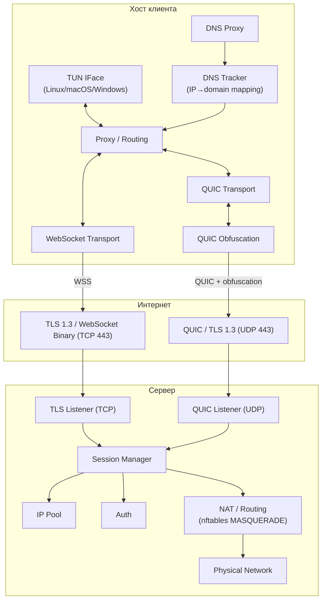

<!-- @sk-task docs-and-release#T4.2: russian translation of architecture (AC-004) -->

# Архитектура

kvn-ws — VPN-туннель поверх HTTPS/WebSocket и QUIC, написанный на Go. Этот документ описывает системную архитектуру, компоненты и потоки данных.

## Обзор



## Компоненты

### Сервер

| Компонент | Пакет | Роль |
|-----------|-------|------|
| TLS Listener | `src/internal/transport/tls/` | Терминация TLS 1.3 (TCP) |
| WebSocket Acceptor | `src/internal/transport/websocket/` | WebSocket upgrade и ввод/вывод бинарных фреймов |
| QUIC Listener | `src/internal/transport/quic/` | QUIC (UDP) listener + ObfuscatedQUICConn |
| Bootstrap | `src/internal/bootstrap/` | Оркестрация сервера: TLS, QUIC, менеджер сессий |
| Session Manager | `src/internal/session/` | Жизненный цикл сессий, выделение/возврат IP, BoltDB |
| IP Pool | `src/internal/session/` | Динамическое выделение IPv4/IPv6 из подсетей |
| Auth | `src/internal/protocol/auth/` | Аутентификация по токену, JWT и basic |
| Control | `src/internal/protocol/control/` | PING/PONG keepalive, управляющие сообщения |
| Admin API | `src/internal/admin/` | HTTP API для управления сессиями и pprof |
| NAT | `src/internal/nat/` | nftables/iptables MASQUERADE (авто-определение) |
| DNS | `src/internal/dns/` | DNS-резолвер с TTL-кэшем в памяти |
| Metrics | `src/internal/metrics/` | Prometheus-метрики (active_sessions, throughput, errors) |
| Rate Limiter | `src/internal/ratelimit/` | IP-ограничитель скорости (token bucket) |
| ACL | `src/internal/acl/` | Контроль доступа по IP через CIDR-правила |

### Клиент

| Компонент | Пакет | Роль |
|-----------|-------|------|
| TUN Interface | `src/internal/tun/` | Абстракция виртуального сетевого интерфейса. Платформы: Linux (tun), Windows (Wintun), macOS (utun), stub |
| Routing Engine | `src/internal/routing/` | RuleSet: server/direct, CIDR, IP, домены (suffix + exact). DNS tracker для IP→domain маппинга |
| Tunnel Session | `src/internal/tunnel/` | Туннельная сессия: связывает TUN, crypto, proxy, transport |
| Bootstrap | `src/internal/bootstrap/` | Оркестрация клиента: TUN, DNS, proxy, transport. Платформенный DNS: setupDNS/applyDNS/restoreDNS |
| Proxy Listener | `src/internal/proxy/` | SOCKS5 + HTTP CONNECT прокси для локального трафика |
| Transparent Proxy | `src/internal/transparent/` | Прозрачный прокси через iptables REDIRECT (Linux) |
| System Proxy | `src/internal/systemproxy/` | Управление системными прокси (Linux/macOS/Windows) |
| DNS Proxy | `src/internal/dnsproxy/` | Прокси-сервер DNS: перехват и маршрутизация DNS-запросов. Трекинг IP→domain для domain-based routing |
| DNS Tracker | `src/internal/dns/` | DNS tracker: хранит маппинг IP→domain с TTL. Используется Routing Engine для принятия решения direct/tunnel |
| WebSocket Dialer | `src/internal/transport/websocket/` | Клиентское WebSocket-подключение с опциональным padding |
| uTLS Dialer | `src/internal/transport/tls/` | Браузерный TLS (uTLS, Chrome JA3), кастомный выбор SNI |
| QUIC Dialer | `src/internal/transport/quic/` | QUIC (UDP) dial + ObfuscatedQUICConn |
| DNS Resolver | `src/internal/dns/` | DNS-резолвер с TTL-кэшем |
| Crypto | `src/internal/crypto/` | Шифрование на уровне приложения (AES-256-GCM, per-session key) |
| Web UI | `src/internal/webui/` | Локальный веб-интерфейс (React + REST API для конфига/подключения/мониторинга) |

### Общие

| Компонент | Пакет | Роль |
|-----------|-------|------|
| Config | `src/internal/config/` | Парсинг YAML через viper с переопределением через env |
| Logger | `src/internal/logger/` | Структурированное JSON-логирование через zap |
| Framing | `src/internal/transport/framing/` | Протокол бинарных фреймов (сообщения с префиксом длины) |
| Handshake | `src/internal/protocol/handshake/` | Client/Server Hello для согласования протокола |

## Потоки данных

### Установка соединения (handshake)

Выбор транспорта определяется полем `transport` в конфиге:
- `""` (пусто) или `"tcp"` — WebSocket поверх TLS 1.3 (TCP 443)
- `"quic"` — QUIC поверх TLS 1.3 (UDP 443)

#### WebSocket (TCP)
1. Клиент читает конфиг из `client.yaml`
2. Клиент устанавливает TLS 1.3 соединение с сервером; если `uTLS.enabled` — использует Chrome JA3 fingerprint через `utls.HelloChrome_Auto`; если задан `tls.sni` — выбирает случайный домен при каждом connect
3. Клиент отправляет WebSocket upgrade request с путём из URL (напр. `/api/v1/events`, а не жёстко `/ws`)
4. Сервер проверяет path по `ws_paths` allowlist (404 если неизвестен), принимает WebSocket upgrade в бинарный режим
5. Клиент отправляет `ClientHello` (версия протокола, поддерживаемые возможности)
6. Сервер отвечает `ServerHello` (ID сессии, назначенный IP, возможности)
7. Клиент настраивает TUN-интерфейс с полученным IP
8. Routing engine начинает обработку пакетов

#### QUIC (UDP)
1. Клиент читает конфиг из `client.yaml`
2. Клиент открывает QUIC-соединение (встроенный TLS 1.3 handshake) с сервером; если задан `tls.sni` — выбирает случайный домен при каждом connect
3. Клиент открывает единственный QUIC stream
4. После handshake обе стороны вычисляют 8-байт nonce через TLS Exporter (`ExportKeyingMaterial("kvn-obfuscation", nil, 8)`) — 0 байт на wire
5. Клиент отправляет `ClientHello` с XOR-обфускацией всего payload (не только length prefix)
6. Сервер отвечает `ServerHello` (XOR всего payload)
7. Клиент настраивает TUN-интерфейс с полученным IP
8. Routing engine начинает обработку пакетов

### Передача данных

1. Приложение на клиенте отправляет пакет в TUN-интерфейс
2. Routing engine проверяет правила (ordered): direct или tunnel
3. Для tunnel: пакет инкапсулируется в фрейм (length-prefix + payload), опционально шифруется; для WS транспорта с `padding.enabled: true` — фрейм оборачивается в `[4B длина][payload][random padding]` с выравниванием до `padding.size`
4. Если `transport: quic` с `obfuscation: true`, весь payload XOR'ится с nonce от TLS Exporter (не только length prefix)
5. Сервер получает фрейм, отбрасывает WS padding если включён, расшифровывает при необходимости, извлекает пакет
6. Сервер применяет NAT (MASQUERADE) и пересылает пакет получателю
7. Ответ следует обратным путём: сервер получает → инкапсулирует → отправляет (с XOR всего payload если включена обфускация) → клиент извлекает → инжектирует в TUN

### Маршрутизация на основе DNS (domain-based routing)

1. Приложение отправляет DNS-запрос (A/AAAA для `example.com`)
2. DNS-прокси перехватывает запрос на локальном UDP/TCP порту
3. Домен проверяется по спискам `exclude_domains` и `include_domains`:
   - Если совпадает с exclude — запрос резолвится напрямую через физический интерфейс (`resolveDirect`)
   - Если совпадает с include — запрос резолвится через VPN-туннель
4. После получения ответа DNS tracker сохраняет маппинг `IP → domain` с TTL из DNS-ответа
5. Когда приложение отправляет пакет на этот IP, Routing Engine проверяет трекер:
   - Если IP найден — применяется domain-based правило (exact или suffix match)
   - RouteAction (direct/tunnel) выбирается по наиболее специфичному совпадению
6. Если IP не найден в трекере — применяются обычные CIDR/IP-правила

### Keepalive

- Клиент периодически отправляет PING-фреймы
- Сервер отвечает PONG
- При отсутствии активности в течение `session.idle_timeout_sec` сервер завершает сессию

## Структура кода

```
src/
├── cmd/
│   ├── client/main.go       # Точка входа клиента
│   ├── server/main.go       # Точка входа сервера
│   ├── web/main.go          # Точка входа Web UI (kvn-web)
│   ├── gatetest/main.go     # Утилита gate-тестирования
│   └── stability/main.go    # Утилита stability/soak-тестирования
├── internal/
│   ├── acl/                 # Контроль доступа по CIDR
│   ├── admin/               # Admin HTTP API (сессии, pprof)
│   ├── bootstrap/           # Оркестрация клиента/сервера
│   ├── config/              # YAML конфиг (viper)
│   ├── crypto/              # Шифрование приложения
│   ├── dns/                 # DNS-резолвер + кэш + трекер IP→domain
│   ├── dnsproxy/            # Прокси-сервер DNS
│   ├── logger/              # Структурированное логирование (zap)
│   ├── metrics/             # Prometheus-метрики
│   ├── nat/                 # nftables/iptables MASQUERADE
│   ├── protocol/
│   │   ├── auth/            # Token/JWT/basic аутентификация
│   │   ├── control/         # PING/PONG keepalive
│   │   └── handshake/       # Client/Server Hello
│   ├── proxy/               # SOCKS5 + HTTP CONNECT
│   ├── ratelimit/           # IP-ограничитель скорости (token bucket)
│   ├── routing/             # RuleSet engine
│   ├── session/             # Сессии + IP pool + BoltDB
│   ├── systemproxy/         # Управление системными прокси
│   ├── transparent/         # Прозрачный прокси через iptables (Linux)
│   ├── transport/
│   │   ├── framing/         # Протокол бинарных фреймов
│   │   ├── quic/            # QUIC dial/listen + ObfuscatedQUICConn
│   │   ├── tls/             # TLS конфиг
│   │   └── websocket/       # WebSocket dial/accept
│   ├── tun/                 # TUN-интерфейс
│   ├── tunnel/              # Туннельная сессия VPN
│   └── webui/               # Web UI (React + REST API)
└── pkg/
    └── api/                 # Публичное API (расширяемое)
```
