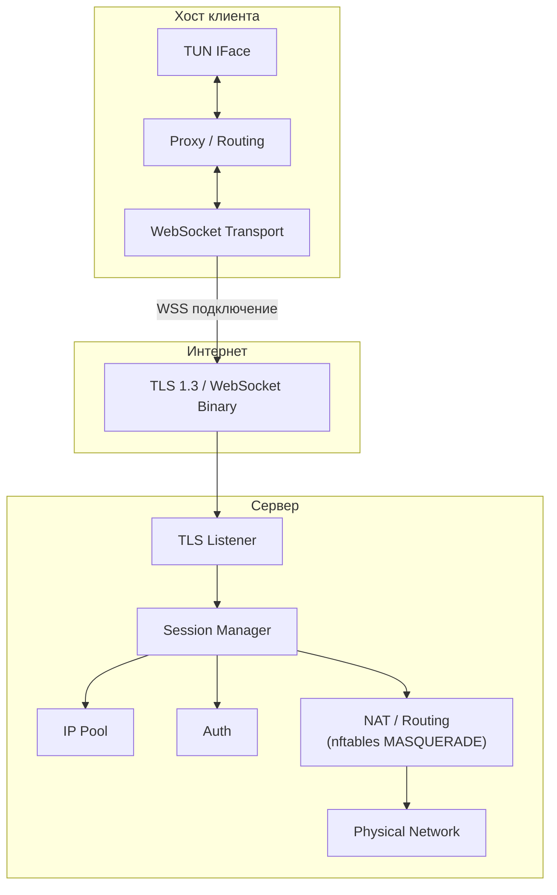

<!-- @sk-task docs-and-release#T4.2: russian translation of architecture (AC-004) -->

# Архитектура

kvn-ws — VPN-туннель поверх HTTPS/WebSocket, написанный на Go. Этот документ описывает системную архитектуру, компоненты и потоки данных.

## Обзор



## Компоненты

### Сервер

| Компонент | Пакет | Роль |
|-----------|-------|------|
| TLS Listener | `src/internal/transport/tls/` | Терминация TLS 1.3 |
| WebSocket Acceptor | `src/internal/transport/websocket/` | WebSocket upgrade и ввод/вывод бинарных фреймов |
| Session Manager | `src/internal/session/` | Жизненный цикл сессий, выделение/возврат IP, BoltDB |
| IP Pool | `src/internal/session/` | Динамическое выделение IPv4/IPv6 из подсетей |
| Auth | `src/internal/protocol/auth/` | Аутентификация по токену, JWT и basic |
| Control | `src/internal/protocol/control/` | PING/PONG keepalive, управляющие сообщения |
| NAT | `src/internal/nat/` | nftables MASQUERADE для проброса трафика |
| DNS | `src/internal/dns/` | DNS-резолвер с TTL-кэшем в памяти |
| Metrics | `src/internal/metrics/` | Prometheus-метрики (active_sessions, throughput, errors) |

### Клиент

| Компонент | Пакет | Роль |
|-----------|-------|------|
| TUN Interface | `src/internal/tun/` | Абстракция виртуального сетевого интерфейса |
| Routing Engine | `src/internal/routing/` | RuleSet: server/direct, CIDR, домены, IP с ordered rules |
| Proxy Listener | `src/internal/proxy/` | SOCKS5 + HTTP CONNECT прокси для локального трафика |
| WebSocket Dialer | `src/internal/transport/websocket/` | Клиентское WebSocket-подключение |
| DNS Resolver | `src/internal/dns/` | DNS-резолвер с TTL-кэшем |
| Crypto | `src/internal/crypto/` | Шифрование на уровне приложения |

### Общие

| Компонент | Пакет | Роль |
|-----------|-------|------|
| Config | `src/internal/config/` | Парсинг YAML через viper с переопределением через env |
| Logger | `src/internal/logger/` | Структурированное JSON-логирование через zap |
| Framing | `src/internal/transport/framing/` | Протокол бинарных фреймов (сообщения с префиксом длины) |
| Handshake | `src/internal/protocol/handshake/` | Client/Server Hello для согласования протокола |

## Потоки данных

### Установка соединения (handshake)

1. Клиент читает конфиг из `client.yaml`
2. Клиент устанавливает TLS 1.3 соединение с сервером
3. Клиент отправляет WebSocket upgrade request на путь `/ws`
4. Сервер принимает WebSocket, переключается в бинарный режим
5. Клиент отправляет `ClientHello` (версия протокола, поддерживаемые возможности)
6. Сервер отвечает `ServerHello` (ID сессии, назначенный IP, возможности)
7. Клиент настраивает TUN-интерфейс с полученным IP
8. Routing engine начинает обработку пакетов

### Передача данных

1. Приложение на клиенте отправляет пакет в TUN-интерфейс
2. Routing engine проверяет правила (ordered): direct или tunnel
3. Для tunnel: пакет инкапсулируется в бинарный WebSocket-фрейм (опционально шифруется)
4. Сервер получает фрейм, расшифровывает при необходимости, извлекает пакет
5. Сервер применяет NAT (MASQUERADE) и пересылает пакет получателю
6. Ответ следует обратным путём: сервер получает → инкапсулирует → отправляет через WebSocket → клиент извлекает → инжектирует в TUN

### Keepalive

- Клиент периодически отправляет PING-фреймы
- Сервер отвечает PONG
- При отсутствии активности в течение `session.idle_timeout_sec` сервер завершает сессию

## Структура кода

```
src/
├── cmd/
│   ├── client/main.go       # Точка входа клиента
│   ├── server/main.go       # Точка входа сервера
│   └── gatetest/main.go     # Утилита gate-тестирования
├── internal/
│   ├── config/              # YAML конфиг (viper)
│   ├── crypto/              # Шифрование приложения
│   ├── dns/                 # DNS-резолвер + кэш
│   ├── logger/              # Структурированное логирование (zap)
│   ├── metrics/             # Prometheus-метрики
│   ├── nat/                 # nftables MASQUERADE
│   ├── protocol/
│   │   ├── auth/            # Token/JWT/basic аутентификация
│   │   ├── control/         # PING/PONG keepalive
│   │   └── handshake/       # Client/Server Hello
│   ├── proxy/               # SOCKS5 + HTTP CONNECT
│   ├── routing/             # RuleSet engine
│   ├── session/             # Сессии + IP pool + BoltDB
│   ├── transport/
│   │   ├── framing/         # Протокол бинарных фреймов
│   │   ├── tls/             # TLS конфиг
│   │   └── websocket/       # WebSocket dial/accept
│   └── tun/                 # TUN-интерфейс
└── pkg/
    └── api/                 # Публичное API (расширяемое)
```
